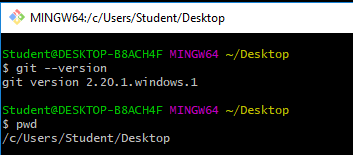
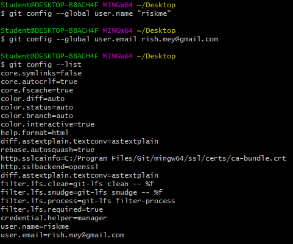
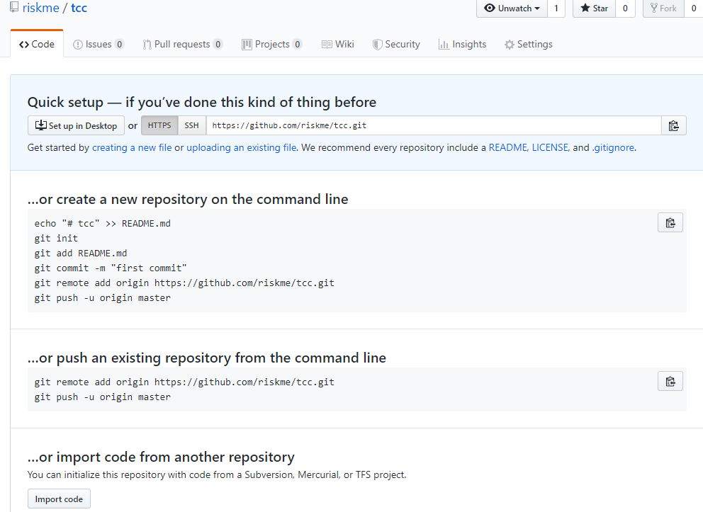
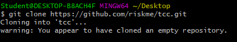
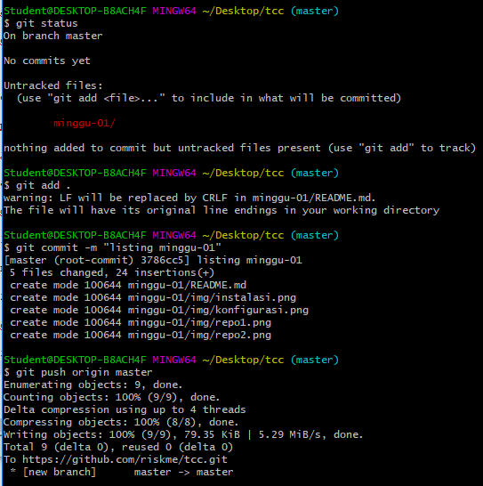
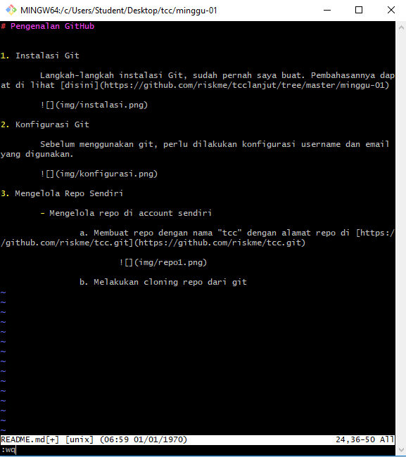

# Pengenalan GitHub

1. Instalasi Git

	Langkah-langkah instalasi Git, sudah pernah saya buat. Pembahasannya dapat di lihat [disini](https://github.com/riskme/tcclanjut/tree/master/minggu-01)

	

2. Konfigurasi Git 

	Sebelum menggunakan git, perlu dilakukan konfigurasi username dan email yang digunakan. 

	

3. Mengelola Repo Sendiri

	- Mengelola repo di account sendiri

		a. Membuat repo dengan nama "tcc" dengan alamat repo di [https://github.com/riskme/tcc.git](https://github.com/riskme/tcc.git)

		

		b. Melakukan cloning repo dari git
		
		
			
		c. Mengelola repo
		
		
			
		Menambahkan file README.md dengan perintah "vim README.md"
			
		
