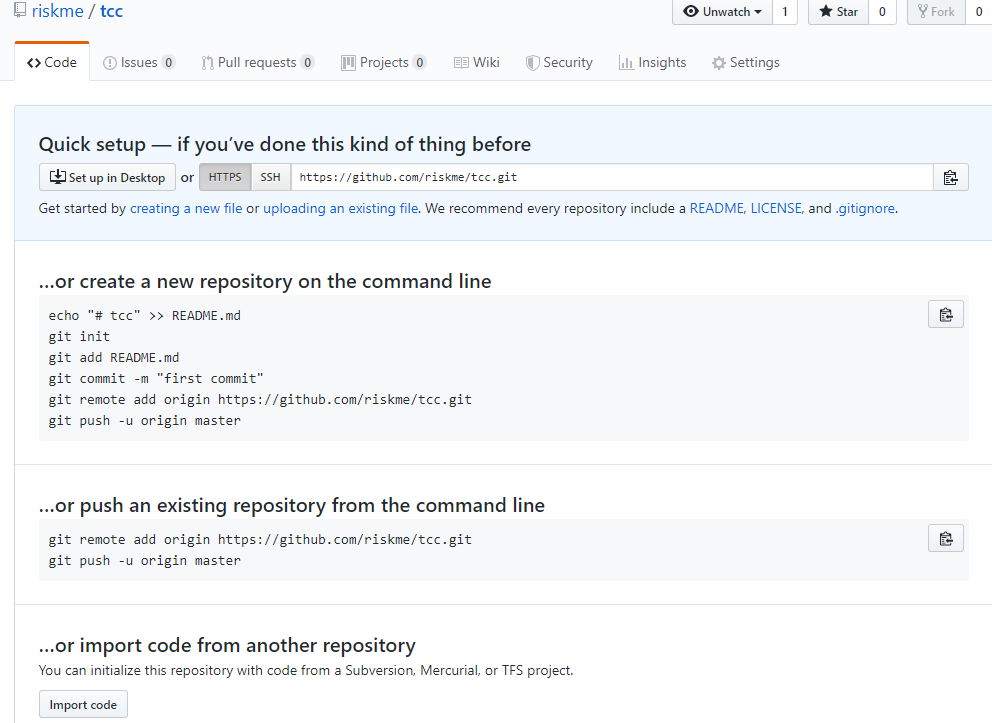
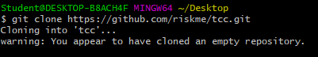
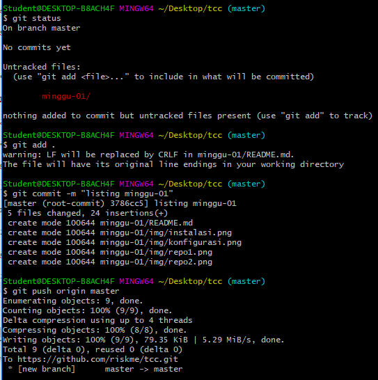
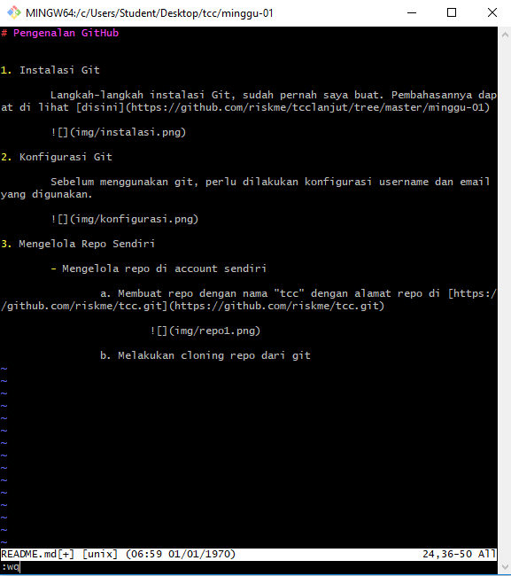

# Mengelola Repo Sendiri

Repositori (repository) dalam bahasa indonesia artinya gudang. Repositori merupakan istilah yang digunakan untuk direktori proyek yang menggunakan Git. Repository adalah asset yang paling kuat dari semua project versioning. Untuk mengubah direktori menjadi repository GIT, menggunakan perintah *git init <directory>*. Folder bernama .git akan muncul di direktori bila perintah tersebut telah dijalankan. Bila telah memiliki direktori sebelumnya dan ingin mengambilnya, dapat digunakan dengan perintah *git clone*.

**Membuat sebuah repo** dapat dilakukan dengan perintah | **git init** | untuk inisasi Git pada folder lokal project yang sudah ada.

**Mengambil sebuah repo**, dengan menggunakan perintah | **git clone /path/to/local/repository** | untuk mengambil repository yang sudah ada pada akun Git ke lokal komputer.

**Mengatur sebuah repo**, dilakukan dengan menggunakan perintah | **git status** | untuk melihat status git yang sudah terpasang pada poject.

Menambahkan perubahan pada proyek, dilakukan dengan perintah | **git add <filename>** | atau | **git add .** | ( *tanda .* artinya menambahkan semua file maupun folder pada project).

Perubahan akan diterapkan pada repository jika sudah melakukan commit dengan perintah | **git commit –m “catatan perubahan yang dilakukan”** |

Untuk mengirimkannya ke repositori jarak-jauh, dilakukan dengan perintah | **git push origin master** | (master dapat diubah sesuai cabang yang diinginkan).

---- -----

  a. Mengambil repo dengan nama "tcc" dengan alamat repo di [https://github.com/riskme/tcc.git](https://github.com/riskme/tcc.git)

   

  b. Melakukan cloning repo dari git

   
			
  c. Mengelola repo
		
   
			
  Menambahkan file README.md dengan perintah "vim README.md"
			
   

