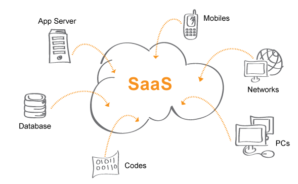
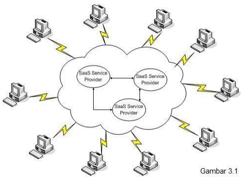
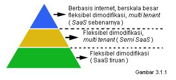
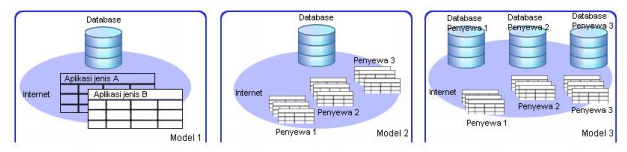
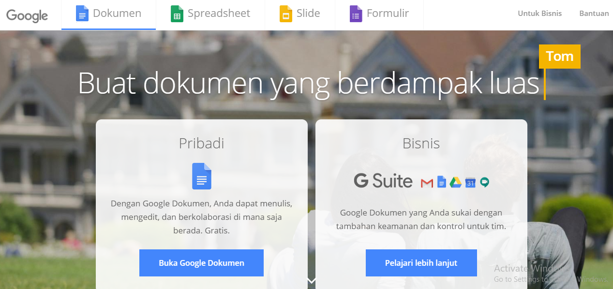

# Software as a Service

SaaS (software as a service atau perangkat lunak berbentuk layanan) adalah suatu model penyampaian aplikasi perangkat lunak oleh suatu vendor perangkat lunak yang mengembangkan aplikasi web yang diinangi dan dioperasikan (baik secara mandiri maupun melalui pihak ketiga) untuk digunakan oleh pelanggannya melalui Internet.

Dengan konsep SaaS, perusahaan tidak perlu menyiapkan infrastruktur sendiri untuk menggunakan software. Cukup dengan mengakses web browser atau aplikasi mobile yang terhubung dengan internet, kita sudah dapat menggunakan software tsb.

## Keunggulan layanan SaaS :

1.	Pengguna tidak perlu mengeluarkan biaya untuk server maupun hardware dalam menjalankan aplikasi, karena telah didukung oleh cloud provider.
2.	Aplikasi telah siap digunakan sehingga pengguna tidak perlu melakukan setup awal yang mungkin akan dikenakan biaya.
3.	Update secara otomatis, dan memungkinkan kompatibilitas antar perangkat.
4.	Dapat diakses dari manapun tanpa terbatas waktu.
5.	Aplikasi dapat disesuaikan, kustomisasi dapat disesuaikan dengan kebutuhan.
6.	Pada sebagian software yang berbayar, pengguna hanya akan dikenakan biaya selama periode langganan saja.

Pengguna saling menggunakan layanan SaaS secara bersama – sama atau on-demand di dalam internet.

## Faktor keberhasilan dalam implementasi dan pengembangan SaaS, yaitu :

* Efisiensi sumber daya komputer 
  SaaS memiliki kemampuan memaksimalkan penggunaan sumber daya komputer seperti pemakaian memory dan bandwidth secara bersamaan, penggunaan database berskala besar untuk berbagai pengguna di berbagai lokasi yang berbeda dalam waktu bersamaan.
* Optimasi data dan multi tenant 
  SaaS memiliki kemampuan untuk memilah data – data dan menseleksi data – data berdasarkan kepemilikan pengguna secara bersamaan dalam satu aplikasi (multi-tenant ).
* Fleksibel aplikasi 
  SaaS memiliki tingkat fleksible yang tinggi dan memungkinkan pengguna memodifikasi aplikasi sesuai kebutuhan pengguna.

Layanan SaaS memiliki tiga model yang masing – masing model tersebut disesuaikan dengan keinginan dan kebutuhan pengguna. Model tersebut digambarkan sebagai berikut :

1. **Model 1** 
  Pengguna layanan SaaS memiliki beberapa aplikasi yang berbeda jenis tetapi hanya memiliki satu database yang di share atau digunakan bersama – sama untuk beragam aplikasi yang dibuat oleh pengguna. Pengguna layanan SaaS ini cukup melakukan modifikasi aplikasi, mengubah skala aplikasi melalui koneksi internet. Layanan SaaS model 1 ini pada umumnya ditawarkan oleh provider dalam bentuk virtualisasi server (VPS) dan bersifat private.

2. **Model 2** 
  Pengguna layanan SaaS ini memiliki aplikasi yang terpisah dan berbeda – beda tetapi mengakses database yang sama atau satu database digunakan secara bersama – sama oleh beragam aplikasi dan beragam pengguna. SaaS model 2 ini umumnya ditawarkan oleh provider dalam bentuk aplikasi berbasis web atau web services, seperti email.

3. **Model 3** 
  Pengguna layanan SaaS ini memiliki masing – masing aplikasi yang berbeda termasuk database yang berbeda dan bersifat private. Satu pengguna memiliki beragam aplikasi tetapi memiliki satu database private yang digunakan untuk aplikasi pengguna itu sendiri. Masing – masing pengguna terpisah secara mandiri baik dari aplikasi maupun secara database. SaaS model 3 ini merupakan model gabungan dari model 1 dan model 2 yang memang dibangun dan dibuat oleh provider SaaS untuk memenuhi kebutuhan pengguna. Salah satu contoh SaaS model 3 adalah aplikasi office suite berbasis web. 

## Kesimpulan dari SaaS( Software as a Service ) 

SaaS merupakan evolusi dari pengembangan software dimana aplikasi tersebut diletakkan di cloud atau internet. Aplikasi tersebut tersedia di internet atau cloud sehingga pengguna tidak perlu melakukan instalasi atau menjalankan aplikasi tersebut di masing – masing komputernya. Sebagai hasilnya pengguna terbebaskan dari urusan maintenance aplikasi. Oleh provider SaaS ditawarkan sebagai pay as you use service , artinya pembayaran atas software atau aplikasi termasuk license didalamnya tidak diperlukan, pembayaran hanya dilakukan ketika aplikasi digunakan dan biaya tersebut dihitung berdasarkan periode biasanya per bulan, per tahun.

# Penerapan Software As A Service pada Google Docs.

Google Docs merupakan produk Google yang dapat digunakan untuk pengolah kata (word processor), lembar kerja (spreadsheet), presentasi, formulir, dan penyimpanan data berbasis web yang dilakukan secara online. Dengan Google Docs kita dapat membuat dan mengedit dokumen secara online dengan mudah serta bisa melakukan pembuatan dokumen bersama dengan orang lain.

Keunggulan Google Docs :

1.	Resiko kehilangan data bisa dihindari.
2.	Dukungan dan support yang lengkap.
3.	Memiliki berbagai fitur seperti memeriksa ejaan dsb.
4.	Bisa diakses dimana saja dan kapan saja.
5.	Bisa digunakan di berbagai sistem operasi.
6.	User bisa mengatur akses terhadap file.

Kelemahan Google Docs :

1.	Membutuhkan koneksi internet agar bisa digunakan.
2.	Hanya bisa diakses secara online.

Fasilitas Google Doc

* Google Dokumen (Word Processor)
 - Membuat dan upload dokumen Word, OpenOffice, RTF, HTML, atau teks.
 - Sharing dengan orang lain (melalui alamat  e-mail) untuk mengedit atau melihat dokumen dan spreadsheet.
 - Mengedit dokumen online dengan siapa pun yang kita pilih.
 - Melihat riwayat revisi dokumen dan spreadsheet 
 - Mendownload dokumen ke desktop sebagai Word, OpenOffice, RTF, PDF, HTML atauzip.
 - Setiap dokumen dapat mencapai sebesar 500K, ditambah 2MB per gambar yangdimasukkan.

* Google Spreadsheet 

 - Spreadsheet sangat skalabel, dengan baris dan kolom praktis tak berujung yang dapat Anda tambahkan pada data.
 - Spreadsheets bersifat fleksibel, dengan kemampuan untuk memasang semua data data pada data bagaian di dalam sel.
 - Spreadsheets menerima rumus dan fungsi sehingga Anda dapat mengambil data mentah dan membuat perhitungan.
 - Kompatible dengan excell.

  

