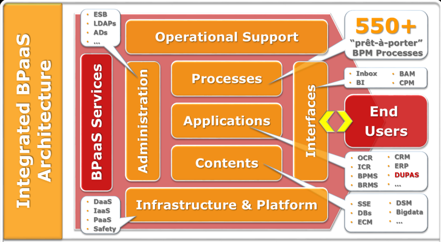
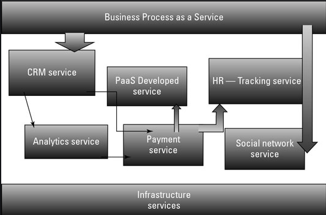
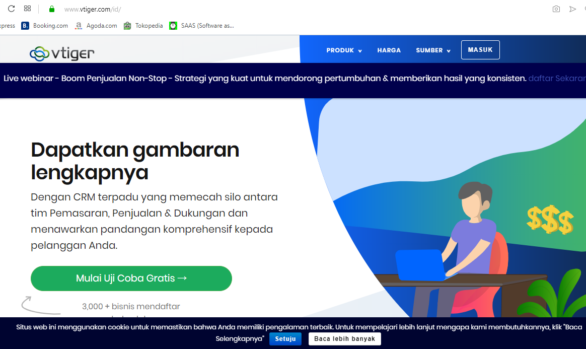
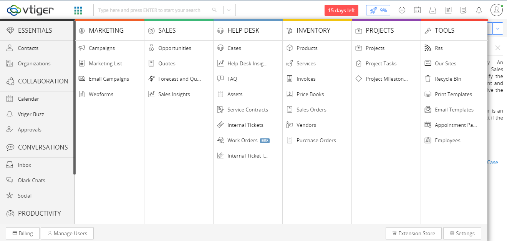

# Businness Process as a Service (BPaaS)

## Pengertian BPaaS

**Proses bisnis** adalah kumpulan aktivitas terstruktur yang saling terkait untuk menyelesaikan suatu masalah tertentu.

**Proses Bisnis sebagai Layanan (BPaaS)** adalah model layanan cloud dimana penyedia layanan (provider) memberikan metode untuk pemodelan, pemanfaatan, penyesuaian, dan pelaksanaan terdistribusi proses bisnis. Proses bisnis yang dapat dijalankan berupa proses horizontal dan proses vertikal.

Proses bisnis Horizontal : merupakan layanan yang melibatkan interaksi dengan mitra bisnis lainnya.
    Contoh : Order-to-cash business process dimana layanan ini memberikan jaminan bahwa pesanan klien pada akhirnya akan dibayarkan.

Proses bisnis Vertical : merupakan layanan yang masih berada dalam batas-batas perusahaan (internal perusahaan).
    Contoh : proses bisnis penggajian karyawan, dimana layanan menangani semua kegiatan yang berkaitan dengan menghitung dan membayar gaji bulanan dan mingguan dan bonus kepada karyawan.

Karakteristik BPAaS:
1. BPaaS duduk di atas tiga layanan awan pendiri lainnya: SaaS, PaaS, dan IaaS.
2. Layanan BPaaS dapat dikonfigurasi berdasarkan proses yang sedang dirancang.
3. Layanan BPaaS harus memiliki API yang terdefinisi dengan baik sehingga mudah dihubungkan ke layanan terkait.
4. BPaaS harus dapat mendukung banyak bahasa dan beberapa lingkungan penerapan karena bisnis tidak dapat memprediksi bagaimana proses bisnis akan dimanfaatkan di masa depan.
5. Lingkungan BPaaS harus bisa menangani skala besar. Layanan harus bisa mendukung ratusan bahkan ribuan pelanggan dan proses. 

# Contoh Aplikasi Business Process as a Service

CRM atau Customer Relationship Management adalah sebuah terobosan yang melatarbelakangi pembuatan strategi bisnis berbasis customer. Tujuan utamanya adalah meningkatkan kepuasan pelanggan. Sedangkan tujuan akhirnya adalah memaksimalkan keuntungan dan pendapatan. CRM sudah dilengkapi dengan analisis customer, vendor, partner, proses informasi internal dan penyimpanan. Sedangkan fungsi-fungsi lain yang mendukung CRM adalah sales, marketing, training, pengembangan profesional, manajemen performa, human resource development, dan kompensasi. CRM adalah salah satu syarat vital bagi bisnis anda untuk memasuki fase berikutnya.

## Vtiger

Aplikasi ini  membantu perusahaan untuk mengorganisir dan memelihara informasi secara efisien di dalam segala aspek yang berkaitan dengan customer. Fitur – fitur inti di dalamnya antara lain:

1. **Customer Relationship Management**: Membantu manage semua data-data customer, dari Accounts, Contact sampai Prospect atas customer yang bersangkutan.
2. **Sales Force Automation**: Melakukan penjualan produk dan billing atas customer. Terdapat menu Quotation, Sales Order hingga Invoice.
3. **Customer Service Tracking**: Menampilkan layanan purna jual di dalam perusahaan. Baik itu complaint maupun service produk. Bisa ditelusuri juga sudah sampai sejauh manakah service customer yang bersangkutan.
4. **News Service**: Semacam memo atau notes yang membantu kita mengingatkan akan hal-hal kecil yang mudah terlupakan.
5. **Corporate Calendar**: Mencatat semua event / kalender penting bagi aktifitas perusahaan. Semua jadwal atau agenda kerja akan muncul di menu ini.
6. **Analytical Reports**: Menyediakan laporan-laporan yang sudah teranalisis dengan baik oleh system.
7. **Material Management**: Berisi fitur mengenai management produk di dalam perusahaan. Baik dari segi produk sampai penambahan dari segi pembelian (Purchase Order) dan pengurangan produk dari segi Penjualan (Sales Order dan Invoice).
8. **Synchronization**: Fitur yang bertujuan untuk mensikronisasi antara Vtiger dengan aplikasi email semacam Microsoft Outlook dan Mozilla Thunderbird.

