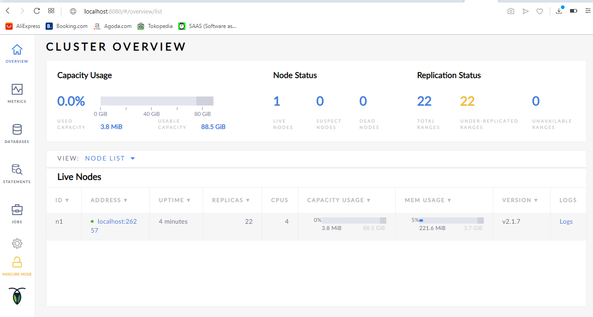

# Install Database CockroathDB di Windows

1. Setelah kita download installer nya, kita ekstrak pada direktori yang kita inginkan.
   
   

2. Selanjutnya kita cek versi DB yang kita gunakan. Perintah nya adalah ``cockroach version``.
   
   

   hasilnya dapat kita lihat bahwa kita menggunakan versi v19.1.1.

3. Selanjutnya kita coba menjalankan DB dengan perintah ``cockroach start --insecure --listen-addr=localhost``. maka database ini telah berjalan. 
   
   

4. Untuk mengeceknnya kita dapat mengakses melalui web browser dengan mengakses ``http://localhost:8080``
   
   