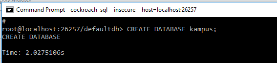
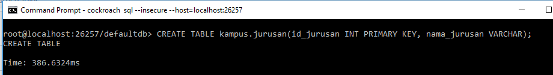
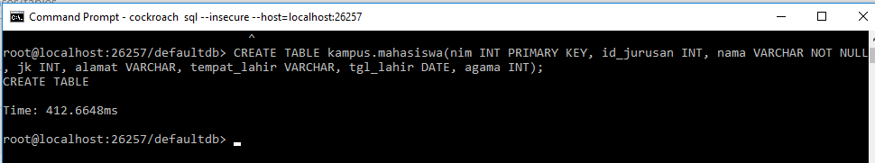
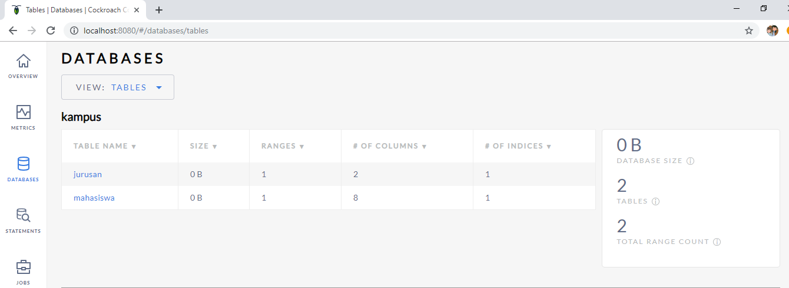
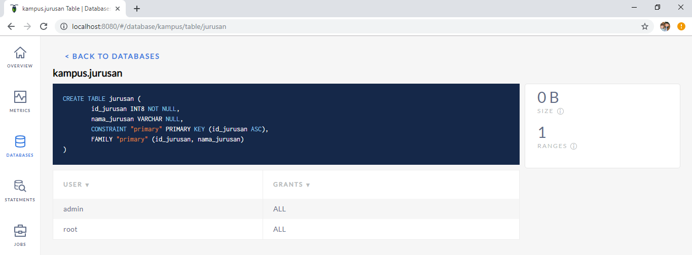
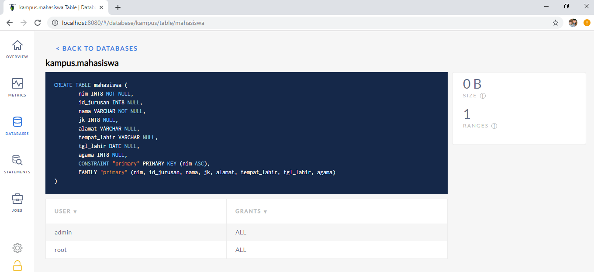

## Membuat Database di CockroachDB Melalui Commant Line

1. Setelah kita jalankan CockroachDB, selanjutnya kita buka terminal baru dan menjalankan perintah ``cockroach sql --insecure --host=localhost:26257``
   
   

   perintah tersebut berarti kita akan masuk pada CLI database.

2. Untuk membuat database baru kita gunakan perintah ``CREATE DATABASE <nama db>`` dimana pada projet ini saya membuat database kampus.
   
   

3. selanjutnya kita buat 2 buah table yaitu jurusan dan mahasiswa. dengan perintah ``CREATE TABLE <nama table>``.
   
   membuat table jurusan
   

   membuat table mahasiswa
   

4. jika kita buka dengan browser maka hasilnya sebagai berikut:
   
   
   
   
   
   