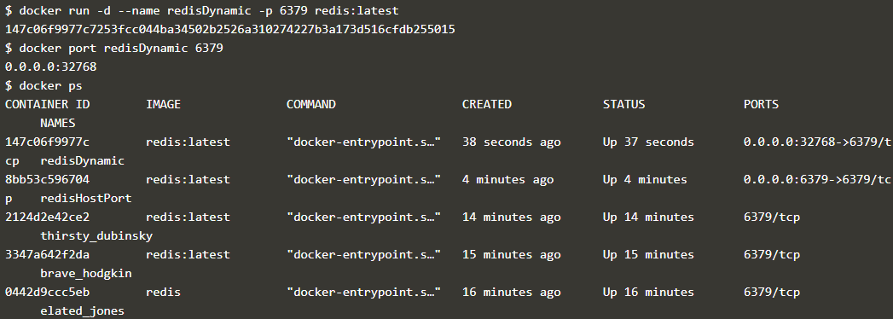

# Courses 1 : Membuat Sebuah Container

Docker container merupakan sebuah image yang bersifat read-write. Pada setiap perubahan yang disimpan pada container akan menyebabkan terbentuknya layer baru di atas image. Developer dapat melakukan instalasi aplikasi didalamnya dan melakukan penyimpanan.

1. Menjalankan sebuah Container bernama Redis

    Untuk menemukan file images dengan nama **redis** pada [registry.hub.docker.com](https://hub.docker.com) dapat dilakukan dengan perintah **"docker search redis"**

      

    
    Dan untuk menjalankan images bernama redis, dilakukan dengan perintah **"docker run -d redis"**

 
      

 2. Melihat Container yang sedang berjalan

    Untuk melihat seluruh container yang berjalan, dilakukan dengan perintah **"docker ps"**

    Perintah ini menampilkan list dari semua container yang berjalan, images yang digunakan untuk menjalankan container dan status uptime-nya.

    
 
3. Menjalankan images redis di port 6379

    Secara default, Redis berjalan pada port 6379. Perintah berikut menjalankan redis container baru yang berjalan pada backgroud proses dengan nama redisHostPort dan bind port 6379 pada container ke port 6379 pada host pc kita.
    **"docker run -d --name redisHostPort -p 6379:6379 redis:latest"**

    

    > **Catatan :**
      Memberikan nama container harus unik, artinya nama dari setiap container tidak boleh ada yang sama, apabila terdapat nama yang sama akan terjadi error.

4. Mengakses images Redis

    Pada langkah sebelumnya, telah didefinisikan port yang dimapping pada docker container ke port pada host pc kita. Opsi **-p** juga dapat membuat mapping container port secara random, yaitu dengan opsi **-p 6379** saja. Hal ini dimaksudkan apabila menjalankan beberapa sevice yang sama pada container yang berbeda tanpa harus mengganti konfigurasi aplikasinya.

    **docker run -d --name redisDynamic -p 6379 redis:latest**
    
    **docker port redisDynamic 6379** digunakan untuk mencari mapping port dinamis yang diberikan olehdocker pada sebuah container.

    

5. Melakukan Maping Data yang ada pada Container

    Data yang disimpan pada container, terus dihapus ketika kita menghapus dan menciptakan kembali container. Untuk itu, perlu mengikat direktori dengan cara di-mount. File-file yang ada di direktori pada host dapat diakses oleh kontainer dan data apa pun yang diubah / ditulis ke direktori di dalam kontainer akan disimpan di host.

    **"docker run -d --name redisMapped -v /opt/docker/data/redis:/data redis"**

    

6. Menjalankan Container di Foreground

    

  - **docker run ubuntu ps** adalah perintah untuk memulai countsiner Ubuntu dan mengeksekusi perintah ps untuk melihat semua proses yang berjalan dalam wadah.
  - **docker run -it ubuntu bash** digunakan untuk mendapatkan akses ke bash shell di dalam sebuah wadah.

## [*Kembali*](README.md "Kembali ke awal")