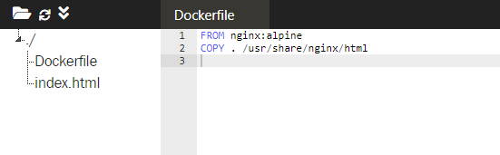
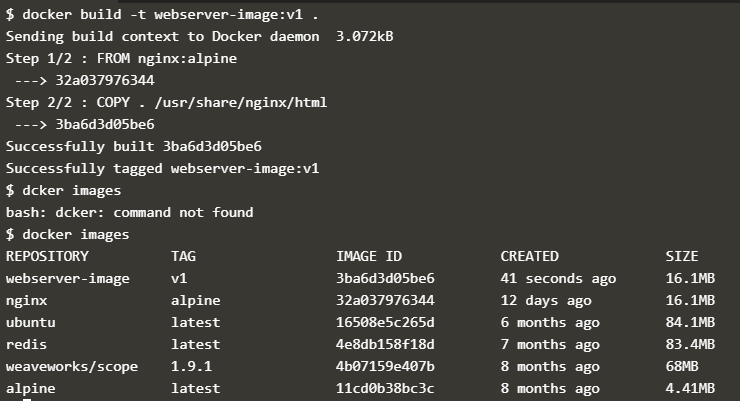
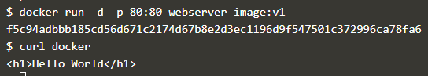
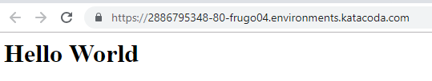

# Courses 2 : Membuat Nginx sebagai Server Web Statis

Pada bagian ini, akan dipelajari cara membuat Docker Image untuk menjalankan website HTML statis menggunakan Nginx. Langkah-langkahnya :

1. Membuat Dockerfile

	Docker image merupakan template dasar untuk docker container. Image ini berisi sistem oeprasi ataupun aplikasi yang sudah selesai. Docker image ini berfungsi untuk menjalankan container.
	Dockerfile merupakan script yang yang berisi dari serangkaian perintah yang akan dieksekusi secara otomatis dan berurutan untuk membuat sebuah image.

	Untuk membangun sebuah Image dilakukan dengan membuat Dockerfile, caranya dengan melalukan proses copy image dasar yaitu Nginx:alpine ke dalam direktori lokasi dalam container kita saat ini.

	

2. Membangun Docker Image

	

	- **"docker build -t webserver-image:v1 ."** digunakan untuk membuat docker image. Parameter **-t** digunakan untuk memberi nama untuk image dan tag. Yang umum dijadikan tag adalah nomor versi image buatan tersebut.
	Image yang dibuat bernama *webserver-image* dengan tag adalah *v1*.
	- **docker images** digunakan untuk melihat list semua images yang digunakan oleh host.

3. Menjalankan Docker Image yang dibuat

	

	- **docker run -d -p 80:80 webserver-image:v1** perintah ini digunakan untuk menjalankan image webserver-image versi v1. Dan karena ini adalah web server, dilakukan pengikatan port 80 ke host menggunakan parameter -p.
	- **curl docker** digunakan untuk mengakses hasil dari port 80.

	

## [*Kembali*](README.md "Kembali ke awal")