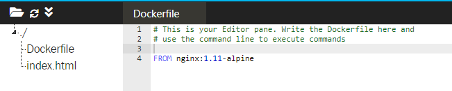
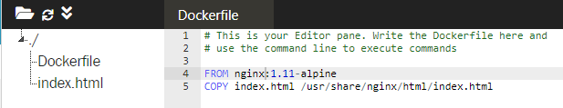
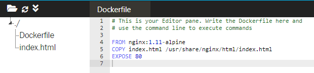
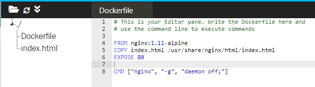
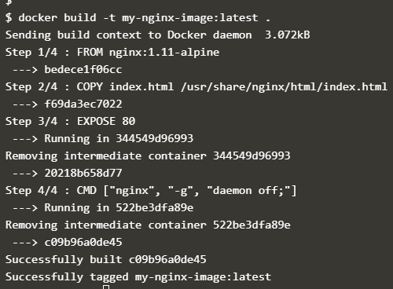
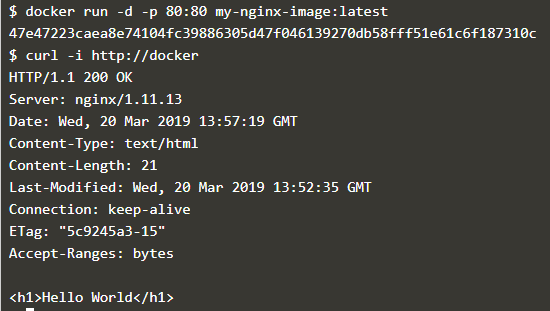
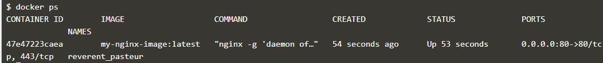

# Courses 3 : Membangun Image Container

Docker Image dibangun berdasarkan Dockerfile. Dockerfile mendefinisikan semua langkah yang diperlukan untuk membuat Docker Image dengan aplikasi yang telah dikonfigurasikan dan siap dijalankan sebagai Container. Sebuah Image itu telah berisi segalanya, dari sistem operasi hingga dependensi dan konfigurasi yang diperlukan untuk menjalankan suatu aplikasi.

1. Image Dasar
	
	Untuk mendefinisikan docker image yang akan digunakan pada instruksi-instruksi berikutnya, atau sebagai Base Image nya, digunakan Instruksi **FROM**.

	 **FROM <image-name>:<tag>**

	 - Image yang digunakan bisa didapat dari lokal atau public image, jika tidak terdapat pada lokal pc, maka docker akan melakukan pull terhadap image di docker registry. 
	- Tag merupakan opsional, tanpa tag yang spesifik, image dengan tag latest menjadi defaultnya. 

	 

	 Image yang dipakai sebagai image dasar adalah NGINX dengan versi 1.11-alpine.

2. Mengkonfigurasi Image Dasar

	Untuk mengkonfigurasi image dasar yang telah ditentukan tersebut dengan perintah **FROM**, dapat menggunakan 2 perintah utama yaitu COPY dan RUN.

	- **RUN <perintah>** digunakan untuk mengeksekusi/menjalankan berbagai perintah seperti menginstal paket aplikasi atau menjalankan perintah build.
	- **COPY <src> <dest>** digunakan untuk menyalin file dari direktori yang berisi dockerfile ke Image Container.

	

	Perintah COPY digunakan untuk menyalin index.html ke direktori /usr/share/nginx/html 

3. Exposing Ports
	Digunakan untuk menentukan port mana yang aplikasi perlukan untuk dapat diakses. Perintah nya : **EXPOSE <port>**

	 

4. Default Commands
	
	**CMD ["nginx", "-g", "daemon off;"]**

	Perintah **CMD** digunakan untuk menset perintah default, yang akan dijalankan ketika akan menjalankan sebuah container tanpa perintah yang spesifik. Jika menjalankan suatu perintah yang spesifik pada container tersebut, argument CMD ini akan diabaikan.

	

	NGINX akan menjadi entrypoint dengan -g daemon off; sebagai perintah default. ENTRYPOINT mendefinisikan perintah yang dapat memiliki argumen yang diteruskan ketika container diluncurkan.

5. Building Containers

	Perintah build mengambil dalam direktori yang berisi Dockerfile, menjalankan langkah-langkah dan menyimpan image di Docker Engine lokal. 

	**docker build -t my-nginx-image:latest .**

	Perintah **-t <nama>** digunakan untuk memberi nama.

	

6. Menjalankan Image Baru

	**docker run -d -p 80:80 my-nginx-image:latest**

	Perintah diatas digunakan untuk menjalankan image my-nginx-image versi latest. Perintah **-d** akan menjalankan container dengan mode background. Perintah **-p 80:80** digunakan untuk me-mapping port yang akan digunakan yaitu port 80.

	**curl -i http://docker**

	Perintah diatas digunakan untuk menampilkan hasil.

	

7. Menampilkan list container

	

## [*Kembali*](README.md "Kembali ke awal")

	
	
