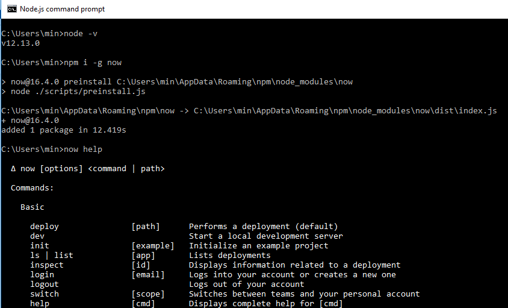
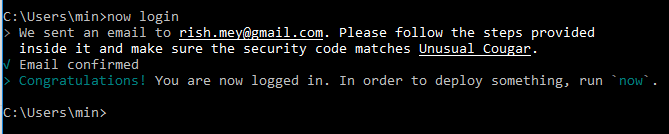
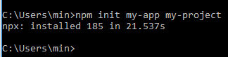

# PaaS Provider

PaaS merupakan singkatan dari “platform as a service”. Opsi ini biasanya digunakan untuk menyediakan framework bagi developer untuk dibuat. Dari sudut pandang pengembangan, solusi PaaS begitu populer karena opsi ini mengurangi waktu ke market dan memungkinkan fleksibilitas yang lebih besar.

## Pengenalan ZEIT Now

Zeit merupakan Platform Cloud berbasis Docker yang menyediakan layanan service untuk memfasilitasi deploying web berbasis Node (React, Angular, Vue, etc).
NodeJS identik dengan CLI, maka sistem deploy Zeit Now pun dapat dengan mudah diakses melalui CLI dengan hanya mengetik command `now` pada direktori projek NodeJS, aplikasi akan langsung meluncur ke dunia nyata. Zeit Now memiliki service gratis dengan limitasi Bandwith sebesar 1GB, total instance maksimal 3 buah dan menggunakan domain .now.sh .

## Intalasi Zeit

1. Instal NodeJs
2. Instal Zeit Now CLI melalui Nodejs command prompt
 

3. Login ke dalam Zeit Now
 

3. Membuat project dengan my-app my-project
 

## https://www.pythonanywhere.com

## https://gigalixir.com