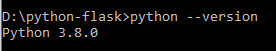

# Python + Flask dan menjalankannya dengan Docker

## Memasang Python
Lakukan pemasangan python bila sistem belum memiliki package Python. Untuk mendapatkan berkasnya, download [disitus Python](https://www.python.org/downloads/).

Untuk memastikan Python sudah terpasang dengan baik, buka sebuah jendela terminal dan ketikkan **python3**, atau jika tidak berhasil, coba hanya mengetikkan **python**.

Untuk keluar dari interactive prompt python ketikkan exit() dan tekan Enter atau dengan shortcut Ctrl-Z diikuti tombol Enter.

## Memasang Flask dan Membuat Halaman Hello World
1. Untuk melakukan instalasi Flask dilakukakn dengan perintah *"pip install flask"*.
 

2. Membuat file Flask + Python sederhana dengan nama **app.py** untuk menampilkan "Hello Word"
 

3. Menjalankan file Flask Python dengan perintah *"python app.py"*
 

4. Akses **http://127.0.0.1:5000/** melalui browser untuk melihat tampilan
 
 
 
 