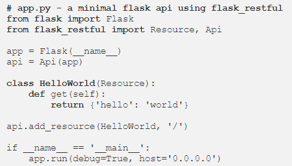
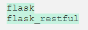
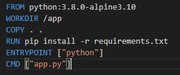
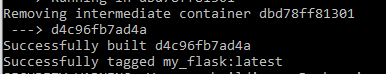
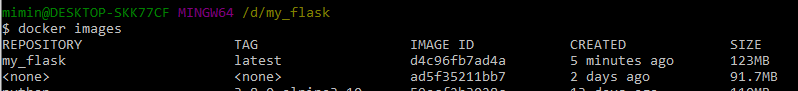
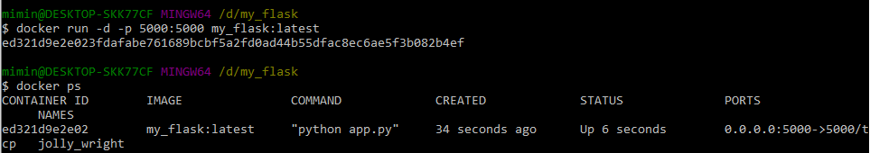
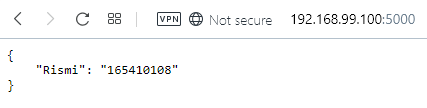

# Melanjutkan Python + Flask + Docker

## Membuat file flask sederhana

1. Membuat file app.py
  File ini membutuhkan REST API untuk itu dibutuhkan Flask-RESTful. sehingga terlebih dahulu harus menginstal Flask-RESTful dengan perintah *pip instal flask-restful*
    
  

2. Membuat requirements.txt
 File ini digunakan untuk menyimpan nama-nama paket dan versinya yang digunakan pada apikasi ini. Sehingga komputer lain dapat menggunakan file ini untuk menginstal semua paket yang digunakan aplikasi ini.

 Pada aplikasi ini, hanya memerlukan file flask dan flask-restful sehingga ini dari file **requirements.txt** nya adalah

  

3. Membuat Dockerfile
 Dokerfile yang dibuat ini berisi script :

  

4. Membuat docker image dengan perintah *docker build -t my_flask:latest .*

  

  

5. Menjalankan images
  Docker images telah berhasil di buat, namun aplikasi ini belum dapat berjalan. Untuk menjalankannya, menggunakan perintah *docker run -d -p 9000:9000 my_flask:latest*

  

  hasil nya dapat dilihat pada browser dengan alamat http://http://192.168.99.100:5000

  

## Melakukan Push Docker Imange ke Docker Hub

1. 