# Git Kolaborasi - Fork

Mem-"fork" berarti menyalin sebuah project, mengubah namanya, serta membuat sebuah project dan komunitas dengan salinannya.

Langkah-langkah :

1. Klik tombol "fork" pada repo dimana kita akan melakukan kontribusi. Repo yang digunakan adalah [project milik Hasan](https://github.com/hasan354313/175410211.git) .

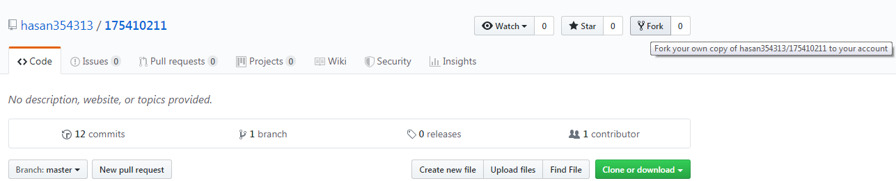

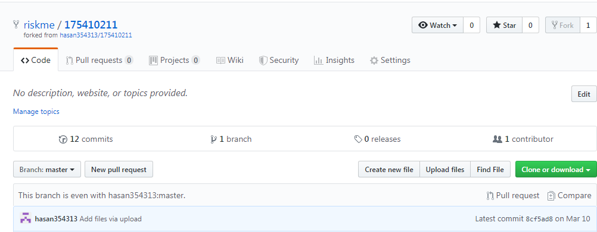

Maka repositori kita akan ada sebuah project baru, yaitu mirror/copy dari fork project tersebut.

2. Melakukan cloning proect fork tersebut ke local.

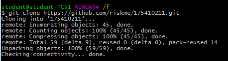

3. Mendaftarkan repository asal untuk melakukan sinkronisasi repo local dengan repo master (milik Hasan) agar tidak terjadi konflik dengan kontributor lainnya.

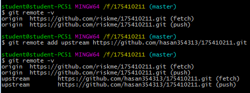

  - origin: menunjuk ke repo local di akun kita hasil dari fork.

  - upstream: menunjuk ke repo asli/master di account asal.

  - *git remote -v* digunakan untuk melihat remote yang terdaftar.

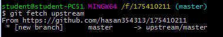

  Perintah *git fetch* hanya akan mengambil revisi (commit) saja dan tidak langsung melakukan penggabungan (merge) terhadap repository lokal.

4. Menampilan riwayat commit dari repo asal menggunakan perintah ls -la

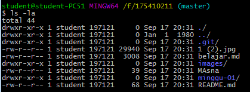

5. Membuat branch baru agar tidak merusak history branch utama. Branch baru diberi nama kontributor. Perintah *git branch* digunakan untuk melihat data branch yang ada.

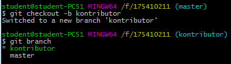

6. Melakukan perubahan pada proyek, dengan menambahkan file text dengan editor vim. Untuk melihat isi dari file text tersebut, di gunakan perintah *cat*

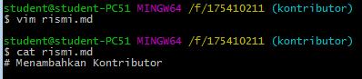

7. Lakukan penyimpanan perubahan ke dalam branch kontributor.

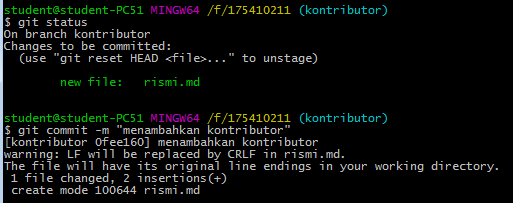

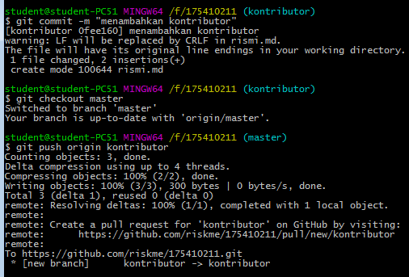

  Push perubahan kedalam branch kontributor. Untuk itu perlu keluar terlebih dahulu dari branch kontributor dengan perintah *git checkout master*.

8. Melakukan pull-request

  Pull request artinya notifikasi ke administrator/maintainer project asal untuk melihat perubahan yang sudah dilakukan. Bila perubahannya dinilai bermanfaat dan bisa dipakai (tidak error, kualitas coding rapih, dan berbagai kriteria lain), maka maintainer akan mengambil (pull) perubahan tersebut dari repo kita. 

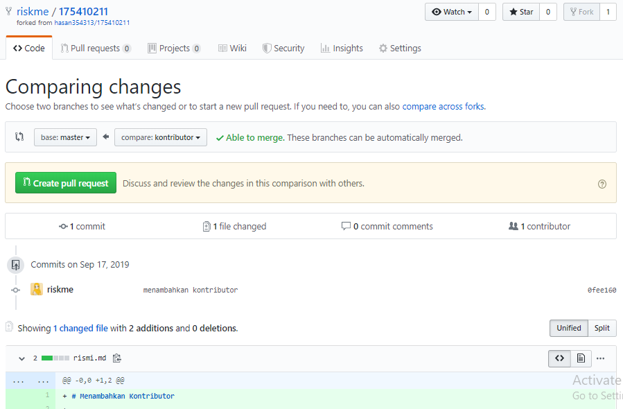

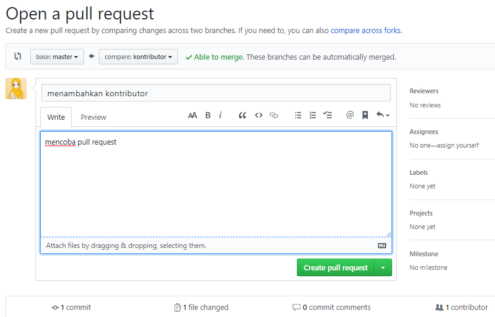

