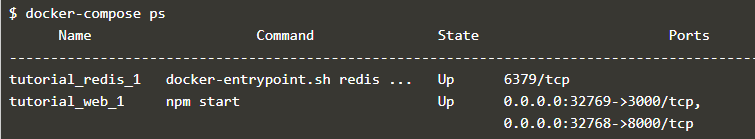
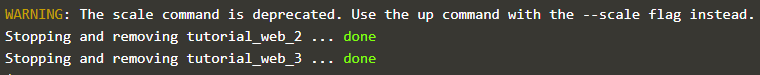

# Membuat Docker Compose untuk Drupal

## Docker Compose

Compose adalah alat untuk mendefinisikan dan menjalankan aplikasi Docker multi-kontainer. 
Docker compose bisa menyimpan konfigurasi dalam file, berarti semua perubahan dependency service, seperti versi database dan service lain dapat dimasukkan dalam VCS (Version Control System).

Docker Compose digunakan untuk menyimpan konfigurasi dalam file, yang artinya semua perubahan dependency service, seperti versi database dan service lain dapat dimasukkan dalam VCS (Version Control System). Dengan VCS dapat lebih mudah men-debug jika terjadi error pada software.

1. **Mendefinisikan Container pertama**

	Docker Compose didasarkan pada file docker-compose.yml. File ini mendefinisikan semua kontainer dan pengaturan yang dibutuhkan untuk meluncurkan kumpulan cluster. Perintah dalam docker-compose.yml ini mendefinisikan container yang disebut web, yang didasarkan pada pembangunan direktori saat ini.

	

2. **Mendefinisikan Setting**

	Untuk menghubungkan dua container bersama, maka perlu menentukan properti tautan dan mendaftarkan koneksi yang diperlukan.

	

	- link digunakan untuk menautkan kecontainer redis yang didefinisikan dalam file yang sama dan menetapkan nama alias yang sama.

	- ports digunakan untuk mengekspos port 3000 dan 8000.

3. **Mendefinisikan Container kedua**

	Container kedua ini menggunakan image yang sudah ada pada Docker Hub. Pada file YML, tambahkan sckrip berikut yang digunakan untuk menggunakan image redis.

	

4. **Menjalankan Docker-compose dengan UP**

	

	Argumen -d menyatakan untuk menjalankan kontainer di latar belakang / tidak ditampilkan.

5. **Manajement Docker**

	- docker-compose ps digunakan untuk melihat detail container yang diluncurkan.

	  

	- docker-compose logs digunakan untuk mengakses semua log.

	  

	- docker-compose digunakan untuk menampilkan perintah lain yang dapat digunakan.

	  

	  

6. **Docker Scale**

	Docker compose dapat juga digunakan untuk mengukur jumlah container yang berjalan. Opsi SCALE memungkinkan untuk menentukan layanan dan jumlah instance yang diinginkan. Jika angkanya lebih besar dari instans yang sudah berjalan, maka akan meluncurkan container tambahan. Jika jumlahnya kurang, maka itu akan menghentikan container yang tidak diminta.

	

	

7. **Menghentikan Docker**

	Untuk menghentikan suatu set container dapat di lakukan dengan perintah " docker-compose stop ".

	

	dan untuk menghapus semua container dapat dilakukan dengan perintah " docker-compose rm ". Akan ada pertanyaan konfirmasi dengan mengetik Y atau N.

	